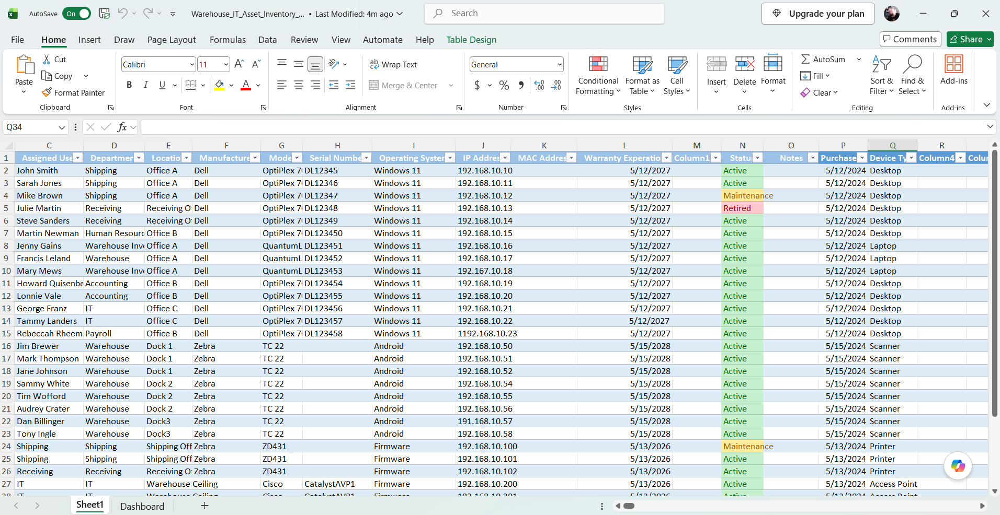
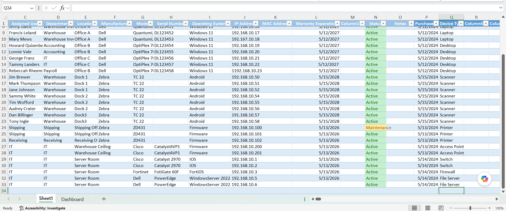
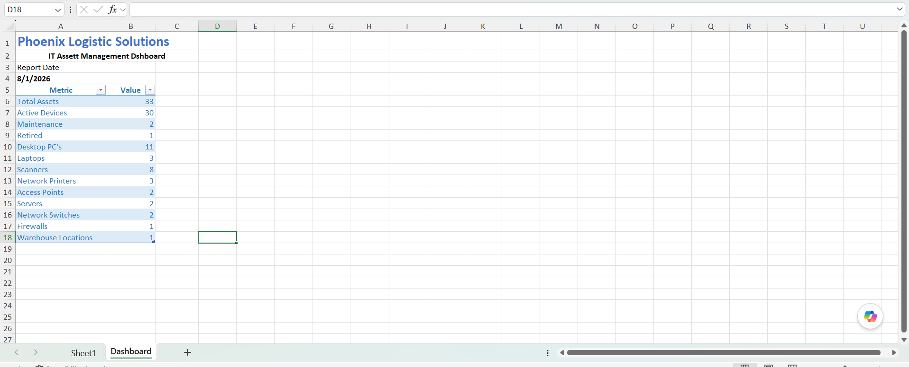

# Enterprise IT Asset Management System

## Overview

This project simulates an enterprise IT asset management system for a warehouse and distribution environment. It demonstrates how IT departments organize, document, and track technology assets that support warehouse operations.

The project includes a detailed asset inventory and an executive dashboard for reporting asset status and inventory metrics.

---

## Project Objectives

- Create a centralized inventory of IT assets
- Track workstations, laptops, servers, barcode scanners, printers, and networking equipment
- Demonstrate professional IT documentation practices
- Build a management dashboard for reporting and decision-making

---

## Environment

**Organization:** Phoenix Logistics Solutions *(Simulated)*

**Department:** Information Technology

---

## Technologies Used

- Microsoft Excel
- Asset Management
- Technical Documentation
- Dashboard Reporting
- Inventory Management

---

## Skills Demonstrated

- IT Asset Management
- Technical Documentation
- Inventory Tracking
- Excel Reporting
- IT Operations
- Hardware Lifecycle Management

---

## Assets Included

- Desktop Computers
- Laptops
- Barcode Scanners
- Network Printers
- Wireless Access Points
- Network Switches
- Firewall
- Domain Controller
- File Server

---

## Project Files

- Warehouse_IT_Asset_Inventory_v1.0.xlsx

---

## Screenshots

### Asset Inventory (Part 1)

### Asset Inventory (Part 2)

### IT Asset Management Dashboard

---
## Project Highlights

- Managed an inventory of 33 simulated IT assets
- Documented warehouse workstations, laptops, barcode scanners, printers, servers, and networking equipment
- Applied standardized asset naming conventions
- Created an executive dashboard for management reporting
- Used conditional formatting to track asset status (Active, Maintenance, Retired)
---
## Lessons Learned

This project improved my understanding of enterprise IT asset management, inventory organization, technical documentation, and reporting. It also reinforced the importance of maintaining accurate records for operational support and hardware lifecycle management.

---

## Future Improvements

- Automatic dashboard calculations
- Warranty tracking
- Purchase date reporting
- Interactive charts
- Asset lifecycle reporting
- Power BI dashboard integration
